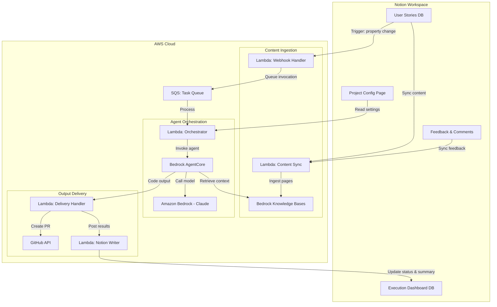

# Notion-AWS Integration for AI-Driven Development Lifecycle

Turn Notion user stories into working code — without leaving Notion.

## The Problem

Product development teams in AI-driven development workshops face three interconnected problems:

**Context Fragmentation** — User stories, acceptance criteria, and design decisions created in Notion must be manually transferred to development environments. Each transfer risks losing nuance, relationships between stories, and team discussion context.

**Platform Switching Overhead** — Teams context-switch between Notion (collaboration), IDE (development), and git (version control). Each switch requires mental model changes and operational steps that break flow.

**AI Capability Gap** — Notion AI handles text generation well but cannot perform coding, multi-session development, or interact with development tools. Teams must leave Notion to leverage AI coding capabilities, fragmenting their workflow.

## The Solution

This project integrates **Notion** with **Amazon Bedrock AgentCore** so that teams can invoke AI agent workloads directly from Notion. Notion becomes the single pane of glass for product decisions. AWS handles computation invisibly behind the scenes.

```
Notion (User Stories & Epics)
    ↓ Trigger (property change / button)
AWS Lambda (Webhook Handler)
    ↓ SQS
Amazon Bedrock AgentCore
    ├── Claude (via Amazon Bedrock) → Code Generation
    ├── Amazon Bedrock Knowledge Bases ← Notion Context
    └── Results → GitHub PR + Notion Update
```

The core value proposition: **a Product Owner writes a user story in Notion and gets a pull request with working code, without leaving Notion.**

## Who This Helps

### Product Owner

> *"I write clear user stories but then have to wait for developers to manually translate them into specs and code. I want to see an MVP faster."*

- Stay entirely in Notion. Write a user story, trigger code generation with 2 clicks.
- Review AI-generated output as a plain-language summary posted to the Notion page.
- Mark output as "Approved" or "Needs Changes" with feedback — a new agent run triggers automatically.
- No IDE, no git, no waiting for a developer to pick up the ticket.

### Development Team Lead

> *"I spend too much time translating Notion stories into technical specs and ensuring nothing is lost in translation."*

- The Spec Agent automates the translation from user story to technical specification.
- Configure project-level constraints (target repo, coding standards, frameworks) once in a Notion config page. Every agent invocation respects those settings.
- Define multi-step workflows (Story → Spec → Code) where each step is reviewable in Notion before the next runs.
- Monitor all agent executions, costs, and errors from a dashboard database in Notion.

### Developer

> *"I have to dig through Notion pages to find the full context behind a user story, then manually set up my development environment with that context."*

- Receive GitHub pull requests that already include the original user story, acceptance criteria, and design context.
- Generated code follows the project's coding standards and repository structure.
- Focus on high-value review and refinement instead of context gathering and boilerplate.

### Workshop Facilitator

> *"Workshop participants get excited about AI coding but lose momentum when they hit the gap between Notion and their development environment."*

- Pre-configured workshop environment eliminates setup friction.
- The full flow (write story → trigger agent → review code) completes within 15 minutes.
- Participants try the flow with their own user stories immediately.
- Workshop materials include a setup guide for teams to replicate the environment.

## Architecture



## Customer Journey

| Phase | Platform | Actor | Activity |
|-------|----------|-------|----------|
| 1. Story Creation | Notion | Product Team | Write user stories, epics, acceptance criteria |
| 2. Context Sync | AWS | System | Ingest Notion content into Knowledge Bases |
| 3. Agent Invocation | Notion → AWS | Team Lead / PO | Trigger agent workload from Notion |
| 4. Implementation | AWS (AgentCore) | AI Agent | Generate specs, code, tests using Claude |
| 5. Delivery | GitHub + Notion | System | Create PR, post summary back to Notion |
| 6. Review & Feedback | Notion + GitHub | Team | Review outputs, provide feedback |
| 7. Iteration | Notion → AWS | Team | Refine stories and re-trigger agents |

## Technology Stack

| Layer | Technology | Purpose |
|-------|-----------|---------|
| Collaboration | Notion | User story management, triggers, result display |
| Webhook Processing | AWS Lambda | Receive and validate Notion triggers |
| Task Queue | Amazon SQS | Decouple trigger reception from agent execution |
| Context Storage | Amazon Bedrock Knowledge Bases | Store and retrieve Notion content for agents |
| Agent Runtime | Amazon Bedrock AgentCore | Serverless execution environment for AI agents |
| Foundation Model | Amazon Bedrock (Claude) | Code generation, spec generation, review |
| Code Delivery | GitHub API | Pull request creation and management |
| Infrastructure | AWS CDK (TypeScript) | Infrastructure as Code |

## Agent Types

The system supports three specialized agents that can be chained into workflows:

- **Spec Agent** — Translates user stories into technical specifications, requirements documents, and task breakdowns.
- **Code Agent** — Generates implementation code, test files, and PR descriptions from user stories or specs.
- **Review Agent** — Validates generated code against acceptance criteria and produces review comments.

Predefined workflow templates: `story-to-code`, `story-to-spec-to-code`.

## Project Structure

```
notion-code/
├── spec/                 # Specifications
│   ├── requirements.md   # User personas, features, acceptance criteria
│   ├── design.md         # Architecture, data models, API contracts
│   ├── tasks.md          # Sprint-based task tracking
│   ├── implementation_qa.md
│   └── proposals/        # Change proposal documents
├── infra/                # AWS CDK infrastructure
│   ├── bin/
│   ├── lib/
│   └── config/
├── src/
│   ├── webhook/          # Notion webhook handler
│   ├── sync/             # Content sync to Knowledge Base
│   ├── orchestrator/     # Agent invocation orchestrator
│   ├── agents/           # Agent definitions (prompts, tools)
│   ├── delivery/         # Output delivery (GitHub, Notion)
│   └── shared/           # Shared utilities, types, config
├── tests/
├── .sandbox/             # Sandbox experiments
└── docs/                 # Workshop and adoption guides
```

## Project Status

Currently in **Sprint 0 — Feasibility & Specification**. Core specifications are complete. Next steps include sandbox verification of Notion API webhooks, Bedrock AgentCore invocation patterns, and Knowledge Base ingestion.

See [spec/tasks.md](spec/tasks.md) for the full task breakdown.

## Dependencies

- [Notion API](https://developers.notion.com/) (v2024-02+)
- [Amazon Bedrock](https://aws.amazon.com/bedrock/) (Claude model access)
- [Amazon Bedrock AgentCore](https://aws.amazon.com/bedrock/agentcore/)
- [Amazon Bedrock Knowledge Bases](https://aws.amazon.com/bedrock/knowledge-bases/)
- [GitHub API](https://docs.github.com/en/rest)

## License

[Apache License 2.0](LICENSE)
