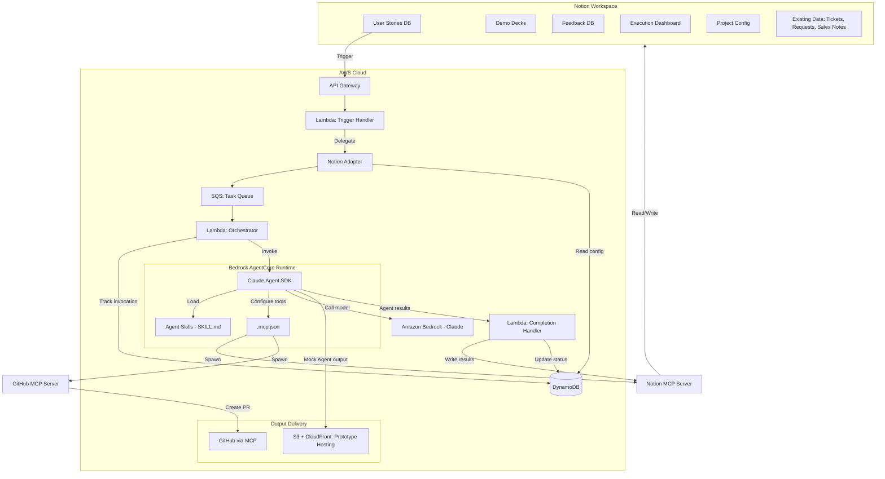

# Notion-AWS Integration for AI-Driven Development Lifecycle

Accelerate product discovery — from idea to validated user story — without leaving Notion.

## The Problem

Product managers spend **1-2 months** to validate a single feature idea:

```
PM has idea → writes story (30 min)
    → asks developer to build prototype (wait 1-3 days)
    → developer builds throwaway prototype (1-2 days)
    → PM schedules customer interviews (wait 2-5 days)
    → PM conducts interviews (1 hour each)
    → PM synthesizes feedback manually (2-4 hours)
    → PM refines story and repeats from the top
```

Three bottlenecks kill velocity:

1. **Developer dependency** — The PM competes for developer time to build something that will be thrown away. The developer is busy with production work.
2. **Interview logistics** — Scheduling, conducting, and synthesizing customer interviews is manual and slow. Feedback lives in notes, not structured data.
3. **Data fragmentation** — Customer signals (support tickets, feature requests, sales notes, interview feedback) are scattered across Notion databases. Nobody has time to cross-reference them.

## The Solution

This project lets PMs **invoke AI agents directly from Notion** to run the entire product discovery loop — prototype, demo, collect feedback, analyze — without developer involvement and without leaving Notion.

```
PM writes user story in Notion
    ↓ Trigger (2 clicks)
AWS (Event Source Adapter → SQS → Bedrock AgentCore → Claude Agent SDK)
    ├── Mock Agent      → Clickable prototype at a shareable URL
    ├── Demo Deck Agent → Notion page: explanation + demo + feedback form
    ├── Insight Agent   → Synthesis of feedback + existing customer data
    └── Code Agent      → GitHub PR (when story is validated)
```

**Fundamental value**: Accelerate product discovery to generate promising user stories, then pass validated stories to developers.

**Fundamental implementation**: A single agent runtime powered by the [Claude Agent SDK](https://docs.anthropic.com/en/docs/agents-and-tools/claude-agent-sdk), hosted on [Amazon Bedrock AgentCore](https://aws.amazon.com/bedrock/agentcore/). Agent behavior is driven by **[Agent Skills](https://agentskills.io)** (SKILL.md files) — developers create skills, PMs trigger them from their workspace. The trigger pipeline uses an event source adapter pattern, with Notion as the launch platform. Agents use [Notion MCP](https://developers.notion.com/docs/mcp) to extract abundant content from the workspace.

## The Discovery Loop

```
Phase 1: Prototype          Mock Agent → clickable prototype in 5 min
Phase 2: Demo & Collect     Demo Deck Agent → Notion page customers navigate + submit feedback
Phase 3: Analyze            Insight Agent → synthesize feedback + existing customer data
Phase 4: Decide             PM reviews synthesis → proceed / pivot / dig deeper
Phase 5: Build              Code Agent → implementation draft as GitHub PR
```

**Time from idea to validated concept: 3-5 days instead of 1-2 months.**

The developer enters at Phase 5 — reviewing an implementation draft for a feature already validated with real customers.

## Skill-Based Agent Architecture

All agents run on a **single base runtime** powered by the Claude Agent SDK. Different agent behaviors are defined by **SKILL.md files** following the [Agent Skills open standard](https://agentskills.io), not separate containers or custom code.

```
agents/
├── Dockerfile                    # Base: Node.js + claude-code + Python
├── main.py                       # AgentCore entrypoint using claude_agent_sdk
├── .mcp.json                     # MCP servers (Notion, GitHub)
├── CLAUDE.md                     # Base system prompt + project context
└── .claude/
    └── skills/
        ├── code-generation/SKILL.md        # → GitHub PR
        ├── prototype-generation/SKILL.md   # → Shareable URL
        ├── demo-deck/SKILL.md              # → Notion page + feedback DB
        ├── insight-synthesis/SKILL.md      # → Cross-referenced synthesis
        └── [developer-created]/SKILL.md    # → Custom capabilities
```

### How It Works

1. **Developer** creates a SKILL.md with instructions, coding patterns, and quality standards
2. **PM** writes a user story in Notion and triggers the appropriate action (e.g., "Generate Prototype")
3. **Claude Agent SDK** auto-discovers the relevant skill by its description and executes it
4. **Results** are posted back to Notion (or deployed to S3, or pushed to GitHub)

This creates a natural collaboration boundary: developers define *how* (via skills), PMs define *what* (via Notion stories), and the agent bridges the gap.

### Discovery Skills (PM-facing, no developer needed)

**Mock Agent** (`prototype-generation`) — Generates a clickable HTML/CSS/JS prototype from a user story. Deployed to a shareable URL. Auto-expires after 7 days. The PM shows it to customers 10 minutes after writing the story.

**Demo Deck Agent** (`demo-deck`) — Generates a complete demo experience as a Notion page: problem explanation, embedded prototype link with guided scenario, and structured feedback form. The customer navigates the explanation, tries the prototype, and submits feedback — all via a single Notion link.

**Insight Agent** (`insight-synthesis`) — Reads feedback from Demo Deck responses AND existing Notion databases (customer tickets, feature requests, sales notes, NPS data). Cross-references new discovery data with historical signals via Notion MCP. Produces pattern analysis, confidence scoring, and a proceed/pivot recommendation.

**A/B Test Agent** (`ab-test`) *(backlog)* — Generates 2-3 variant approaches to the same user problem, each with its own Mock prototype and Demo Deck. Unified feedback database tracks which variant each respondent experienced.

### Delivery Skills (developer reviews output)

**Code Agent** (`code-generation`) — Generates an implementation draft from a validated user story. Creates a GitHub pull request for developer review, with story context and a human-readable summary posted back to Notion.

## Who This Helps

### Product Manager

> *"I have ideas but validating them takes weeks because I depend on developers for prototypes and on my own time for interview synthesis."*

- Generate a clickable prototype in 5 minutes — no developer needed
- Send a Demo Deck to 10 customers simultaneously — feedback collected as structured Notion data
- Insight Agent cross-references demo feedback with 6 months of support tickets you never had time to analyze
- When the story is validated, trigger the Code Agent for an implementation draft — the developer reviews and refines

### Development Team Lead

> *"Half the features we build don't land well with users. I wish the PM had validated them more before asking us to implement."*

- PMs arrive with validated, data-backed user stories instead of untested assumptions
- Monitor all agent executions, costs, and errors from a dashboard in Notion
- Configure project-level constraints (repo, standards, frameworks) once
- Create custom skills that encode your team's coding standards and architecture patterns
- Developers spend time on features that matter, not throwaway prototypes

### Developer

> *"I spend too much time building prototypes that get thrown away after one customer meeting."*

- Never build a throwaway prototype again — the Mock Agent handles it
- Create SKILL.md files to teach agents your team's coding patterns and conventions
- When you receive a PR from the Code Agent, the story behind it has been validated with real customers
- Use [Notion MCP](https://developers.notion.com/docs/mcp) in your IDE to access the same Notion context the agents use

### Workshop Facilitator

> *"Participants lose momentum when they hit the gap between Notion and their development tools."*

- Demo the full discovery-to-delivery loop in a single Notion workspace
- Participants try it with their own stories — everything stays in Notion
- Pre-configured workshop environment eliminates setup friction

## Architecture



## Technology Stack

| Layer | Technology | Purpose |
|-------|-----------|---------|
| Collaboration & Data | Notion | Stories, demo decks, feedback, customer data, results |
| Content Extraction | [Notion MCP](https://developers.notion.com/docs/mcp) (`@notionhq/notion-mcp-server`) | Agents read/write Notion content via MCP protocol |
| Code Operations | [GitHub MCP](https://github.com/modelcontextprotocol/servers) (`@modelcontextprotocol/server-github`) | Agents create branches and PRs via MCP protocol |
| Agent Runtime | [Claude Agent SDK](https://docs.anthropic.com/en/docs/agents-and-tools/claude-agent-sdk) (`claude-agent-sdk`) | Claude Code as a library — built-in tools, skills, MCP, subagents |
| Agent Behavior | [Agent Skills](https://agentskills.io) (SKILL.md) | Open standard for agent behavior configuration |
| Agent Hosting | [Amazon Bedrock AgentCore](https://aws.amazon.com/bedrock/agentcore/) | Serverless microVM execution |
| Foundation Model | Amazon Bedrock (Claude) | All agent intelligence (`CLAUDE_CODE_USE_BEDROCK=1`) |
| Event Source Ingress | API Gateway + AWS Lambda | Trigger handler with platform-specific adapters (Notion adapter for launch) |
| Task Queue | Amazon SQS | Decouple event source adapters from agent execution |
| Invocation Tracking | Amazon DynamoDB | Invocation records, project config, cost tracking |
| Prototype Hosting | S3 + CloudFront | Shareable URLs with auto-expiry for Mock Agent prototypes |
| MCP Gateway *(Sprint 3+)* | AgentCore Gateway | Centralized MCP endpoint with auth, policy, and observability |
| Infrastructure | AWS CDK (TypeScript) | Infrastructure as Code |

## Project Status

Currently in **Sprint 0 — Feasibility & Specification**.

| Sprint | Focus | Key Deliverable |
|--------|-------|-----------------|
| 0 (current) | Feasibility | Sandbox verification of Claude Agent SDK on AgentCore, Notion MCP, Skills loading |
| 1 | Dual Agent MVP | Code Agent (→ GitHub PR) + Mock Agent (→ prototype URL) via Claude Agent SDK |
| 2 | Feedback Loops | Code iteration + Demo Deck Skill + Insight Synthesis Skill |
| 3 | Governance + Gateway | Execution dashboard + project config + MCP Gateway migration + skill management |
| 4 | Workshop & Scale | Workshop kit + Knowledge Base for large workspaces |

See [spec/tasks.md](spec/tasks.md) for the full task breakdown.

## Why Not Just Use Notion MCP?

[Notion MCP](https://developers.notion.com/docs/mcp) gives developers in IDEs direct access to Notion content. It's the right tool for developers. But it doesn't help PMs — they can't use Cursor or Claude Code to generate prototypes, run demos, or synthesize feedback.

Our project and Notion MCP are complementary:
- **Notion MCP** = developer-facing, pull-based (developer asks from IDE)
- **Our project** = PM-facing, push-based (Notion action triggers agent)
- **Together**: Our agents use Notion MCP internally to read workspace content. Developers use Notion MCP directly in their IDEs.

See [competitive analysis](spec/proposals/20260204_notion_mcp_competitive_analysis.md) for the full comparison.

## Why Claude Agent SDK?

Instead of building agent runtimes from scratch, we use the **Claude Agent SDK** — the same runtime that powers Claude Code — as a library. This gives us:

- **Built-in tools** (Read, Write, Edit, Bash, Glob, Grep, WebFetch, etc.) out of the box
- **MCP integration** via declarative `.mcp.json` — no custom client code
- **Agent Skills** ecosystem — behavior via SKILL.md files, not hardcoded prompts
- **Subagent support** for complex multi-step workflows
- **Session management** for multi-turn agent interactions

The skill model enables **PM-developer collaboration**: developers define agent capabilities as SKILL.md files (coding patterns, quality standards, architecture rules), and PMs invoke those capabilities from Notion without understanding the technical details.

See [ecosystem design proposal](spec/proposals/20260204_claude_code_ecosystem_design.md) for the full architecture rationale.

## Dependencies

- [Claude Agent SDK](https://docs.anthropic.com/en/docs/agents-and-tools/claude-agent-sdk) — Agent runtime (Claude Code as a library)
- [Agent Skills](https://agentskills.io) — Open standard for agent behavior (SKILL.md)
- [Notion API](https://developers.notion.com/) + [Notion MCP](https://developers.notion.com/docs/mcp) — Workspace access
- [GitHub MCP](https://github.com/modelcontextprotocol/servers) — Code operations
- [Amazon Bedrock](https://aws.amazon.com/bedrock/) — Claude model access
- [Amazon Bedrock AgentCore](https://aws.amazon.com/bedrock/agentcore/) — Serverless agent hosting
- [AWS CDK](https://aws.amazon.com/cdk/) — Infrastructure as Code

## License

[Apache License 2.0](LICENSE)
