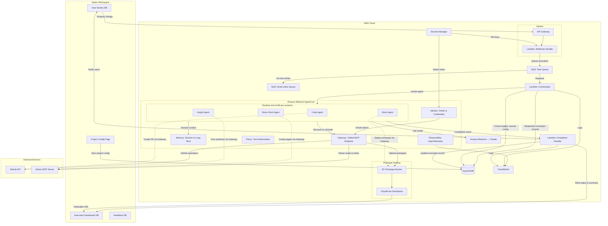

# Design Specification

**Project**: Notion-AWS Integration for AI-Driven Development Lifecycle (AI DLC)
**Version**: 0.2.0
**Last Updated**: 2026-02-04

## 1. Architecture Overview

### 1.1 High-Level Architecture



### 1.2 Technology Stack

| Layer | Technology | Purpose | Sprint |
|-------|-----------|---------|--------|
| Collaboration | Notion | User story management, trigger source, feedback collection | 1 |
| HTTP Ingress | Amazon API Gateway | HTTPS endpoint for Notion webhooks | 1 |
| Task Queue | Amazon SQS + DLQ | Decouple trigger reception from agent execution | 1 |
| Agent Runtime | Amazon Bedrock AgentCore Runtime | Serverless microVM execution for AI agents (container-based) | 1 |
| Tool Management | Amazon Bedrock AgentCore Gateway | Unified MCP endpoint aggregating Notion MCP, GitHub, S3 tools | 1 |
| Context (MVP) | Notion MCP Server | On-demand reads from Notion workspace via MCP protocol | 1 |
| Foundation Model | Amazon Bedrock (Claude) | Code generation, prototype generation, review, synthesis | 1 |
| Code Delivery | GitHub API (via MCP) | Pull request creation and management | 1 |
| Prototype Hosting | Amazon S3 + CloudFront | Shareable URLs for generated prototypes with auto-expiry | 1 |
| Invocation Tracking | Amazon DynamoDB | Agent invocation records, project config, cost tracking | 1 |
| Secrets | AWS Secrets Manager | Notion tokens, GitHub tokens, API keys | 1 |
| Agent Identity | AgentCore Identity | OAuth credential management for agent-to-tool auth | 1 |
| Monitoring | AgentCore Observability + CloudWatch | OpenTelemetry traces, metrics, cost dashboards | 1 |
| Agent Memory | AgentCore Memory | Short-term (session) and long-term (cross-session) context | 2 |
| Tool Policy | AgentCore Policy | Real-time tool-call authorization via Cedar policies | 3 |
| Context (Scale) | Amazon Bedrock Knowledge Bases | Pre-indexed Notion content for faster retrieval at scale | 4 |
| Content Ingestion | AWS Lambda (Content Sync) | Batch ingestion of Notion content into Knowledge Bases | 4 |
| Infrastructure | AWS CDK (TypeScript) | Infrastructure as Code | 1 |

### 1.3 Design Principles

1. **AgentCore-Centric**: Agents run on AgentCore Runtime with full tool ownership — agents create PRs, deploy prototypes, and write Notion pages directly via Gateway tools, not through intermediary Lambdas
2. **Event-Driven**: All workflows are triggered by events (Notion property changes, SQS messages, agent completion), not polling
3. **Serverless-First**: No long-running servers; all compute is on-demand (Lambda, AgentCore Runtime microVMs)
4. **Gateway as Tool Hub**: All external tool access (Notion MCP, GitHub, S3) flows through AgentCore Gateway for centralized auth, discovery, and policy enforcement
5. **Thin Orchestration Layer**: Lambda functions handle only queuing, budget checks, and status tracking — agents handle all business logic
6. **Decoupled Components**: SQS between webhook handler and orchestrator allows independent scaling and retry
7. **Idempotent Operations**: All handlers are idempotent; duplicate events produce the same result
8. **Observable from Day One**: Every component emits structured logs and OpenTelemetry traces to CloudWatch
9. **Multi-Agent by Design**: Each agent type is a separate AgentCore Runtime with independent versioning, scaling, and rollback

## 2. Data Models

### 2.1 Agent Invocation Record

Stored in DynamoDB; status mirrored to the Notion execution dashboard.

| Field | Type | Description |
|-------|------|-------------|
| invocation_id | string (ULID) | Unique identifier for this invocation |
| notion_page_id | string | Source Notion page that triggered this invocation |
| workspace_id | string | Notion workspace identifier |
| agent_type | enum | `code`, `mock`, `demo_deck`, `insight`, `spec`, `review`, `a_b_test` |
| status | enum | `queued`, `running`, `completed`, `failed`, `cancelled` |
| input_context | object | Serialized user story, acceptance criteria, related page IDs |
| output_summary | string | Human-readable summary of what the agent produced |
| output_artifacts | list\<Artifact\> | Structured list of outputs (see 2.1.1) |
| parent_invocation_id | string (nullable) | For chained workflows (e.g., mock → demo_deck), the previous step's ID |
| config | object | Project settings snapshot applied to this invocation |
| cost_usd | decimal | Actual cost of this invocation (runtime + model + tools) |
| token_usage | object | `{input_tokens, output_tokens, total_tokens}` |
| session_id | string | AgentCore Runtime session ID |
| started_at | datetime | When agent execution began |
| completed_at | datetime (nullable) | When agent execution finished |
| error_detail | string (nullable) | Error information if status is `failed` |
| created_at | datetime | Record creation timestamp |

#### 2.1.1 Output Artifact Schema

Each entry in `output_artifacts` follows this structure:

| Field | Type | Description |
|-------|------|-------------|
| type | enum | `pull_request`, `prototype`, `notion_page`, `notion_database`, `insight_report` |
| url | string | Accessible URL (GitHub PR URL, CloudFront URL, Notion page URL) |
| title | string | Human-readable title |
| metadata | object | Type-specific metadata (see below) |
| expires_at | datetime (nullable) | For prototypes: auto-expiry timestamp |

**Type-specific metadata examples**:

- `pull_request`: `{repo, branch, pr_number, files_changed}`
- `prototype`: `{s3_key, cloudfront_url, expiry_days, screenshot_url}`
- `notion_page`: `{page_id, parent_page_id, page_type}`
- `notion_database`: `{database_id, record_count}`

### 2.2 Project Configuration

Stored in DynamoDB; editable via Notion configuration page.

| Field | Type | Description |
|-------|------|-------------|
| project_id | string | Unique project identifier |
| workspace_id | string | Notion workspace identifier |
| notion_database_id | string | Notion database containing user stories |
| github_repo | string | Target repository (owner/name) |
| github_branch_strategy | enum | `feature-branch`, `direct-to-main` |
| coding_standards | text | Free-text coding conventions for agents |
| framework_preferences | list | Preferred frameworks/libraries |
| agent_chain_template | enum | `story-to-code`, `story-to-mock-to-deck`, `custom` |
| trigger_map | map | Maps trigger values to agent types (see Section 3.1) |
| prototype_expiry_days | integer | Default TTL for prototypes (default: 7) |
| cost_limit_per_invocation | decimal | Max USD per single agent run |
| cost_limit_per_month | decimal | Max USD per month for this project |
| month_to_date_cost | decimal | Running total, updated after each invocation |
| knowledge_base_id | string (nullable) | Associated Bedrock Knowledge Base ID (Sprint 4+) |
| created_at | datetime | Record creation timestamp |
| updated_at | datetime | Last update timestamp |

### 2.3 Feedback Database Schema (Notion)

Created by the Demo Deck Agent as a Notion database. Read by the Insight Agent for synthesis.

| Notion Property | Type | Description |
|-----------------|------|-------------|
| Title | title | Feedback entry identifier (auto-generated) |
| Respondent | rich_text | Customer or respondent name |
| Demo Deck | relation | Relation to the demo deck page |
| User Story | relation | Relation to the originating user story |
| Overall Rating | number | 1-5 overall rating |
| Clarity Rating | number | 1-5 clarity of problem/solution |
| Desirability Rating | number | 1-5 desirability of proposed solution |
| Open Feedback | rich_text | Free-text qualitative feedback |
| Would Use | select | `Yes`, `No`, `Maybe` |
| Top Concern | rich_text | Primary concern or objection |
| Submitted At | date | When feedback was submitted |

### 2.4 Notion Content Document (Knowledge Base — Sprint 4+)

Ingested into Bedrock Knowledge Bases as structured documents. Not used in MVP.

| Field | Type | Description |
|-------|------|-------------|
| page_id | string | Notion page identifier |
| parent_page_id | string (nullable) | Parent page for hierarchy |
| title | string | Page title |
| content_markdown | text | Page content converted to markdown |
| page_type | enum | `epic`, `user_story`, `task`, `design`, `general` |
| properties | object | Notion database properties (status, assignee, priority, etc.) |
| comments | list | Page comments and discussions |
| last_edited_at | datetime | Last edit time in Notion |
| ingested_at | datetime | When this version was ingested |

## 3. API Design

### 3.1 Webhook Endpoint (Notion → AWS)

| Method | Endpoint | Description |
|--------|----------|-------------|
| POST | /webhook/notion | Receives Notion webhook events for page updates |

**Request Body** (from Notion webhook):
```json
{
  "type": "page.updated",
  "page_id": "abc-123",
  "workspace_id": "ws-456",
  "properties_changed": ["Status"]
}
```

**Trigger Dispatch Table**:

The webhook handler reads the new `Status` property value and maps it to an agent type using the project's `trigger_map` configuration:

| Trigger Value | Agent Type | Output |
|--------------|------------|--------|
| Generate Code | `code` | GitHub PR |
| Generate Prototype | `mock` | S3/CloudFront prototype URL |
| Generate Demo Deck | `demo_deck` | Notion pages + feedback database |
| Synthesize Feedback | `insight` | Notion page with synthesis |

Unrecognized trigger values are ignored (logged at DEBUG level).

**SQS Message Schema** (enqueued by webhook handler):
```json
{
  "invocation_id": "01HQXYZ...",
  "workspace_id": "ws-456",
  "notion_page_id": "abc-123",
  "agent_type": "mock",
  "trigger_value": "Generate Prototype",
  "project_id": "proj-789",
  "page_snapshot": {
    "title": "User can preview dashboard layout",
    "properties": {},
    "content_markdown": "..."
  }
}
```

### 3.2 Internal Orchestration API

| Method | Endpoint | Description |
|--------|----------|-------------|
| POST | /invoke | Queue a new agent invocation |
| GET | /invocation/{id} | Get invocation status and results |
| POST | /invocation/{id}/cancel | Cancel a running invocation |
| GET | /project/{id}/invocations | List invocations for a project |
| GET | /project/{id}/cost-summary | Get month-to-date cost breakdown |

### 3.3 Content Sync API (Sprint 4+)

| Method | Endpoint | Description |
|--------|----------|-------------|
| POST | /sync/page | Trigger sync for a specific Notion page |
| POST | /sync/database | Trigger sync for an entire Notion database |
| GET | /sync/status/{job_id} | Check sync job status |

## 4. Component Design

### 4.1 Webhook Handler (Lambda)

**Purpose**: Receives Notion webhook events via API Gateway, validates them, resolves the target agent type, and queues an invocation.

**Inputs**: Notion webhook POST payload via API Gateway
**Outputs**: SQS message for orchestrator

**Key Logic**:
1. Validate webhook signature using the signing secret from Secrets Manager
2. Parse the event and fetch the updated page from Notion API
3. Read the new `Status` property value
4. Look up the project's `trigger_map` in DynamoDB to resolve `agent_type`
5. If no matching trigger, return 200 (acknowledge but no-op)
6. Snapshot the page content (title, properties, markdown body) into the SQS message
7. Enqueue invocation message to SQS with a deduplication ID based on `page_id + trigger_value` to ensure idempotency

### 4.2 Orchestrator (Lambda)

**Purpose**: Dequeues invocation requests, enforces cost limits, invokes the correct AgentCore Runtime agent, and tracks status.

**Inputs**: SQS invocation message
**Outputs**: AgentCore Runtime invocation, DynamoDB status updates

**Key Logic**:
1. Dequeue invocation request from SQS
2. Create invocation record in DynamoDB (status: `queued`)
3. **Pre-invocation budget check**:
   - Read `month_to_date_cost` and `cost_limit_per_month` from project config
   - If budget exhausted, set status to `failed` with error `BUDGET_EXCEEDED`, post status to Notion, and return
4. Resolve the AgentCore Runtime ARN for the requested `agent_type`
5. Assemble the agent payload:
   - User story content (from the page snapshot in the SQS message)
   - Project configuration (coding standards, framework preferences, branch strategy)
   - Parent invocation context (for chained workflows — e.g., prototype URL from a prior Mock Agent run)
6. Generate a unique session ID (ULID format, ≥33 characters)
7. Update invocation record to status: `running`
8. Call `InvokeAgentRuntime` with the assembled payload, session ID, and `qualifier=DEFAULT`
9. Read the streaming response to completion
10. On completion, invoke the Completion Handler with the agent output

**Cost Enforcement**:
- The orchestrator passes `cost_limit_per_invocation` as a budget constraint in the agent payload
- Agents are instructed via system prompt to respect token budgets
- AgentCore Runtime's per-second billing is tracked via Observability and reconciled post-invocation

### 4.3 Completion Handler (Lambda)

**Purpose**: Processes agent output, updates tracking records, and writes results back to Notion.

**Inputs**: Agent execution results (from Orchestrator or AgentCore event)
**Outputs**: DynamoDB updates, Notion dashboard updates, user notifications

**Key Logic**:
1. Parse agent output artifacts (PR URLs, prototype URLs, Notion page IDs, etc.)
2. Update invocation record in DynamoDB:
   - Set status to `completed` (or `failed` if agent reported errors)
   - Write `output_artifacts`, `output_summary`, `cost_usd`, `token_usage`
3. Update project's `month_to_date_cost` in DynamoDB (atomic increment)
4. Write to Notion execution dashboard:
   - Invocation status, summary, artifact links, cost
5. Update the originating Notion page:
   - Set status to a completion value (e.g., "Code Generated", "Prototype Ready")
   - Add artifact links as page properties or comments
6. **Notify users**: mention relevant Notion users on the results page to trigger Notion's built-in notification system
7. For chained workflows (`agent_chain_template`), enqueue the next step to SQS (e.g., after Mock Agent completes, queue Demo Deck Agent with the prototype URL)

### 4.4 AgentCore Gateway Configuration

**Purpose**: Provides a single unified MCP endpoint that all agents connect to for tool access. Centralizes authentication, tool discovery, and policy enforcement.

**Gateway Targets**:

| Target | Type | Tools Provided | Auth |
|--------|------|---------------|------|
| Notion MCP Server | MCP Server | `notion_search`, `notion_read_page`, `notion_read_database`, `notion_create_page`, `notion_update_page`, `notion_create_database` | OAuth via AgentCore Identity (Notion integration token) |
| GitHub | MCP Server | `github_create_branch`, `github_commit_files`, `github_create_pr`, `github_read_file` | OAuth via AgentCore Identity (GitHub App credentials) |
| S3 Prototype Uploader | Lambda | `s3_upload_prototype`, `s3_generate_url` | IAM role |
| Code Sandbox | AgentCore Code Interpreter | `execute_code`, `install_package` | Built-in |

**Agent → Gateway Connection** (in agent code):
```python
from strands import Agent
from strands.models import BedrockModel
from strands.tools.mcp.mcp_client import MCPClient
from mcp.client.streamable_http import streamablehttp_client

mcp_client = MCPClient(lambda: streamablehttp_client(
    url=GATEWAY_MCP_ENDPOINT,
    headers={"Authorization": f"Bearer {access_token}"}
))

with mcp_client:
    tools = mcp_client.list_tools_sync()
    agent = Agent(
        model=BedrockModel(model_id="anthropic.claude-sonnet-4-20250514"),
        system_prompt=SYSTEM_PROMPT,
        tools=tools
    )
    result = agent(payload["prompt"])
```

**Semantic Tool Discovery**: Gateway's `enable_semantic_search=True` allows agents to discover tools by describing what they need, rather than requiring hardcoded tool names.

### 4.5 Agent Definitions (AgentCore Runtime)

Each agent type is deployed as a separate AgentCore Runtime with its own container image, system prompt, and tool configuration. All agents connect to the shared Gateway for tool access.

#### 4.5.1 Code Agent (Sprint 1)

| Aspect | Detail |
|--------|--------|
| **Purpose** | Generate implementation code from user stories and create GitHub PRs |
| **Input** | User story (title, acceptance criteria, body) + project config (coding standards, framework preferences, branch strategy) |
| **Gateway Tools** | Notion MCP (read context: related stories, design docs), GitHub (create branch, commit files, create PR), Code Interpreter (run tests, validate syntax) |
| **Output** | GitHub PR with implementation code, test files, and description referencing the Notion story |
| **System Prompt Focus** | Follow project coding conventions; generate implementation drafts with tests; create descriptive PR titles and bodies; reference the Notion page ID in the PR description |
| **Chaining** | Terminal — does not trigger subsequent agents |

#### 4.5.2 Mock Agent (Sprint 1)

| Aspect | Detail |
|--------|--------|
| **Purpose** | Generate interactive HTML/CSS/JS prototypes from user stories and deploy to shareable URLs |
| **Input** | User story (title, acceptance criteria, UI description) |
| **Gateway Tools** | Notion MCP (read context: UI specs, design references), Code Interpreter (validate prototype renders), S3 Prototype Uploader (deploy files) |
| **Output** | CloudFront URL to the deployed prototype, screenshot |
| **System Prompt Focus** | Generate self-contained HTML/CSS/JS prototypes that demonstrate the user experience described in the story; optimize for clarity over production quality; include realistic sample data |
| **Prototype Structure** | Single-page or multi-page HTML with inline CSS/JS, deployed to `s3://{bucket}/{invocation_id}/` with S3 lifecycle rule for auto-expiry |
| **Chaining** | Can trigger Demo Deck Agent (passes prototype URL as context) |

#### 4.5.3 Demo Deck Agent (Sprint 2)

| Aspect | Detail |
|--------|--------|
| **Purpose** | Generate a structured Notion page sequence for customer demos and create a feedback collection database |
| **Input** | User story + prototype URL (from Mock Agent or manual) |
| **Gateway Tools** | Notion MCP (read context, create pages, create database) |
| **Output** | Notion page sequence (problem → solution → prototype link → call to action) + feedback database with pre-populated questions |
| **System Prompt Focus** | Create compelling narrative flow; structure pages for non-technical stakeholders; generate feedback questions that capture desirability, clarity, and concerns; link prototype URL prominently |
| **Feedback DB** | Creates a Notion database following the schema in Section 2.3, pre-populated with question prompts |
| **Chaining** | Terminal — Insight Agent is triggered manually after feedback is collected |

#### 4.5.4 Insight Agent (Sprint 2)

| Aspect | Detail |
|--------|--------|
| **Purpose** | Synthesize feedback from the feedback database and designated Notion data sources into actionable insights |
| **Input** | Feedback database ID + list of additional Notion page/database IDs to analyze |
| **Gateway Tools** | Notion MCP (read feedback database, read designated data sources, write synthesis page) |
| **Output** | Notion page with quantitative summary (ratings, trends) and qualitative synthesis (themes, quotes, recommendations) |
| **System Prompt Focus** | Aggregate numerical ratings with statistics; identify recurring themes in open-ended feedback; surface direct quotes as evidence; produce prioritized recommendations; remain objective and evidence-based |
| **Chaining** | Terminal |

#### 4.5.5 Spec Agent (Backlog)

| Aspect | Detail |
|--------|--------|
| **Purpose** | Translate user stories into detailed technical specifications |
| **Input** | User story + context from Notion MCP |
| **Gateway Tools** | Notion MCP (read context) |
| **Output** | Technical specification document (requirements, design notes, task breakdown) |
| **Chaining** | Can trigger Code Agent |

#### 4.5.6 Review Agent (Backlog)

| Aspect | Detail |
|--------|--------|
| **Purpose** | Review generated code against acceptance criteria |
| **Input** | Generated code (from PR) + acceptance criteria + context |
| **Gateway Tools** | Notion MCP (read criteria), GitHub (read PR diff, post review comments) |
| **Output** | Review comments, pass/fail assessment, suggested improvements |
| **Chaining** | Terminal |

#### 4.5.7 A/B Test Agent (Backlog)

| Aspect | Detail |
|--------|--------|
| **Purpose** | Generate variant prototypes for A/B testing |
| **Input** | User story + variant parameters |
| **Gateway Tools** | Notion MCP, Code Interpreter, S3 Prototype Uploader |
| **Output** | Multiple prototype URLs with variant descriptions |
| **Chaining** | Can trigger Demo Deck Agent per variant |

### 4.6 Content Sync (Lambda — Sprint 4+)

**Purpose**: Ingests Notion content into Bedrock Knowledge Bases for faster retrieval at scale.

**Inputs**: Notion page ID or database ID
**Outputs**: Updated Knowledge Base documents

**Key Logic**:
1. Fetch page content and sub-pages from Notion API (respecting rate limits)
2. Convert Notion blocks to markdown format
3. Extract and preserve properties, comments, and relationships
4. Upsert documents into Knowledge Base with metadata
5. **Incremental sync**: Compare `last_edited_time` from Notion against `ingested_at` in Knowledge Base metadata; only re-ingest changed pages
6. Triggered by webhook events or manual sync API call (not polling)

**Context Strategy Evolution**:
- **Sprint 1–3 (MVP)**: Agents use Notion MCP via Gateway for on-demand reads. No Content Sync needed.
- **Sprint 4+ (Scale)**: Agents prefer Knowledge Base retrieval for frequently accessed content, with Notion MCP as fallback for real-time data. Content Sync runs on a schedule and on webhook events.

## 5. AgentCore Runtime Deployment

### 5.1 Container Structure

Each agent type is packaged as a container image pushed to Amazon ECR:

```
agents/
├── code-agent/
│   ├── Dockerfile
│   ├── agent.py              # Agent entrypoint (Strands Agent)
│   ├── prompts/
│   │   └── system_prompt.md  # System prompt template
│   └── requirements.txt
├── mock-agent/
│   ├── Dockerfile
│   ├── agent.py
│   ├── prompts/
│   │   └── system_prompt.md
│   └── requirements.txt
├── demo-deck-agent/
│   └── ...
├── insight-agent/
│   └── ...
└── shared/
    ├── gateway_client.py     # Shared Gateway connection logic
    └── utils.py              # Shared utilities
```

### 5.2 Agent Entrypoint Pattern

All agents follow a consistent entrypoint pattern using the Strands Agents framework:

```python
from bedrock_agentcore import BedrockAgentCoreApp
from strands import Agent
from strands.models import BedrockModel
from strands.tools.mcp.mcp_client import MCPClient
from mcp.client.streamable_http import streamablehttp_client
import os, json

app = BedrockAgentCoreApp()

SYSTEM_PROMPT = open("prompts/system_prompt.md").read()
GATEWAY_URL = os.environ["GATEWAY_MCP_ENDPOINT"]

def create_agent(access_token: str) -> Agent:
    mcp_client = MCPClient(lambda: streamablehttp_client(
        url=GATEWAY_URL,
        headers={"Authorization": f"Bearer {access_token}"}
    ))
    mcp_client.__enter__()
    tools = mcp_client.list_tools_sync()
    return Agent(
        model=BedrockModel(model_id=os.environ.get("MODEL_ID", "anthropic.claude-sonnet-4-20250514")),
        system_prompt=SYSTEM_PROMPT,
        tools=tools
    )

@app.entrypoint
def invoke(payload: dict) -> dict:
    access_token = payload.get("gateway_token")
    agent = create_agent(access_token)
    prompt = payload.get("prompt", "")
    result = agent(prompt)
    return {
        "status": "completed",
        "summary": result.message,
        "artifacts": payload.get("artifacts", []),
        "token_usage": {
            "input_tokens": result.token_usage.input_tokens,
            "output_tokens": result.token_usage.output_tokens
        }
    }

if __name__ == "__main__":
    app.run()
```

### 5.3 Versioning and Endpoints

| Concept | Detail |
|---------|--------|
| **Versions** | Each container push creates an immutable version (V1, V2, ...) |
| **DEFAULT endpoint** | Auto-points to the latest version |
| **Custom endpoints** | Create `dev`, `staging`, `prod` endpoints per agent for safe rollouts |
| **Rollback** | Point an endpoint to a previous version if issues are detected |
| **A/B testing** | Create a `beta` endpoint routed to a subset of invocations for evaluation |

### 5.4 Session Management

| Aspect | Detail |
|--------|--------|
| Session ID format | ULID (≥33 characters) |
| Session isolation | Each invocation gets a dedicated microVM with isolated CPU, memory, and filesystem |
| Idle timeout | 15 minutes |
| Max session duration | 8 hours |
| Post-termination | microVM is destroyed, memory is sanitized |
| Reuse | Same session ID reuses the microVM for multi-turn interactions (future use) |

## 6. Security Architecture

### 6.1 Authentication

- **Notion**: OAuth 2.0 integration token managed by AgentCore Identity, stored in Secrets Manager as the seed credential
- **GitHub**: GitHub App credentials managed by AgentCore Identity, stored in Secrets Manager
- **AWS**: IAM roles with least-privilege policies per Lambda function and per AgentCore Runtime
- **Agent-to-Gateway**: OAuth bearer tokens issued by AgentCore Identity, scoped per agent type

### 6.2 Authorization

- **Webhook endpoint**: API Gateway validates Notion webhook signatures
- **Lambda IAM roles**: Scoped per function (e.g., orchestrator can invoke AgentCore but cannot write to S3 directly)
- **AgentCore Runtime**: microVM isolation ensures agents cannot access other sessions
- **AgentCore Gateway**: Routes tool calls through AgentCore Identity for per-user, per-tool authorization
- **AgentCore Policy (Sprint 3+)**: Cedar policies for real-time tool-call authorization (e.g., "agents cannot delete Notion pages", "agents cannot push to main branch")

### 6.3 Data Encryption

- In transit: TLS 1.2+ for all API calls (Notion, GitHub, AWS internal)
- At rest: AES-256 via AWS KMS for DynamoDB, S3, SQS, Knowledge Bases

### 6.4 Secrets Management

- All credentials in AWS Secrets Manager with automatic rotation where supported
- AgentCore Identity manages OAuth token refresh for Notion and GitHub
- No credentials in code or environment variables — environment variables reference Secrets Manager ARNs or AgentCore Identity endpoints

### 6.5 Prototype Security

- S3 bucket is private; all access is through CloudFront with signed URLs or Origin Access Identity
- Prototypes are isolated by `invocation_id` prefix — no cross-prototype access
- S3 lifecycle rules auto-delete prototypes after `prototype_expiry_days` (default: 7)

## 7. Error Handling

### 7.1 Error Response Format

All internal APIs return errors in a consistent format:
```json
{
  "error": {
    "code": "BUDGET_EXCEEDED",
    "message": "Monthly budget of $50.00 has been exhausted ($51.23 spent)",
    "invocation_id": "01HQXYZ...",
    "remediation": "Increase cost_limit_per_month in project settings or wait until the next billing cycle"
  }
}
```

### 7.2 Error Codes

| Code | Component | Description |
|------|-----------|-------------|
| `INVALID_WEBHOOK` | Webhook Handler | Webhook signature validation failed |
| `UNKNOWN_TRIGGER` | Webhook Handler | Status value does not match any trigger in trigger_map |
| `BUDGET_EXCEEDED` | Orchestrator | Monthly or per-invocation cost limit reached |
| `AGENT_TIMEOUT` | Orchestrator | Agent execution exceeded session timeout |
| `AGENT_ERROR` | AgentCore Runtime | Agent encountered an unrecoverable error |
| `TOOL_AUTH_FAILED` | Gateway | OAuth token expired or insufficient permissions |
| `TOOL_RATE_LIMITED` | Gateway | External API rate limit hit (Notion, GitHub) |
| `DELIVERY_FAILED` | Completion Handler | Failed to write results to Notion or update dashboard |
| `CHAIN_FAILED` | Completion Handler | Failed to enqueue the next step in a chained workflow |

### 7.3 Retry Strategies

| Component | Retry Policy | Max Retries | Backoff |
|-----------|-------------|-------------|---------|
| Notion API calls (via Gateway) | On 429 and 5xx | 5 | Exponential with jitter, respect `Retry-After` header |
| SQS message processing | On Lambda failure | 3 | SQS visibility timeout (30s, 60s, 120s) |
| AgentCore Runtime invocation | On transient errors | 2 | 30s, 60s |
| GitHub API calls (via Gateway) | On 5xx | 3 | Exponential (2s, 4s, 8s) |
| S3 uploads | On 5xx | 3 | Exponential (1s, 2s, 4s) |

### 7.4 Dead Letter Queue

Failed SQS messages (after max retries) are sent to a DLQ. A CloudWatch alarm triggers on DLQ depth > 0, notifying the team.

### 7.5 Logging

- Structured JSON logs to CloudWatch Logs
- Log levels: ERROR (failures), WARN (retries, rate limits), INFO (invocation lifecycle), DEBUG (detailed context)
- Correlation ID (`invocation_id`) propagated across all components for tracing
- AgentCore Observability provides OpenTelemetry traces for agent reasoning steps, tool invocations, and model interactions

## 8. Observability

### 8.1 Metrics

| Metric | Source | Description |
|--------|--------|-------------|
| Invocation count by agent_type | DynamoDB / CloudWatch | Number of agent invocations per type |
| Invocation duration | AgentCore Observability | End-to-end agent execution time |
| Token usage by agent_type | AgentCore Observability | Input/output token consumption |
| Cost per invocation | DynamoDB | USD cost per run |
| Month-to-date cost per project | DynamoDB | Running cost total |
| Tool call latency | AgentCore Gateway | Per-tool response time |
| Error rate by component | CloudWatch | Failure rate per Lambda / agent |
| DLQ depth | CloudWatch | Number of failed messages |
| Prototype deploy count | S3 / CloudWatch | Number of prototypes deployed |

### 8.2 Dashboards

- **Operations Dashboard** (CloudWatch): Invocation throughput, error rates, latency, DLQ depth
- **Cost Dashboard** (CloudWatch): Per-project and per-agent-type cost tracking, budget utilization
- **Agent Quality Dashboard** (AgentCore Evaluations — Sprint 3+): Agent accuracy, tool selection quality, helpfulness scores

### 8.3 Alarms

| Alarm | Threshold | Action |
|-------|-----------|--------|
| DLQ depth > 0 | Any message in DLQ | SNS notification to team |
| Error rate > 10% | 5-minute window | SNS notification to team |
| Monthly cost > 80% of budget | Per project | Notion notification to project owner |
| Monthly cost > 100% of budget | Per project | Block new invocations + Notion notification |

## 9. Deployment Architecture

### 9.1 Infrastructure as Code

All resources defined in AWS CDK (TypeScript), organized by stack:

```
infra/
├── bin/
│   └── app.ts                       # CDK app entry point
├── lib/
│   ├── ingress-stack.ts             # API Gateway + Webhook Handler Lambda
│   ├── orchestration-stack.ts       # Orchestrator Lambda + SQS + DLQ + DynamoDB
│   ├── agentcore-stack.ts           # AgentCore Runtimes + Gateway + Identity config
│   ├── prototype-hosting-stack.ts   # S3 bucket + CloudFront + lifecycle rules
│   ├── completion-stack.ts          # Completion Handler Lambda
│   ├── monitoring-stack.ts          # CloudWatch dashboards, alarms, SNS topics
│   └── knowledge-base-stack.ts     # Sprint 4+: Content Sync Lambda + Knowledge Base
└── config/
    └── environments.ts              # Per-environment configuration
```

### 9.2 Environments

| Environment | Purpose | Notion Workspace | AWS Account |
|-------------|---------|-----------------|-------------|
| dev | Development and testing | Dev workspace | Dev account |
| workshop | Pre-configured for workshop demos | Workshop workspace | Workshop account |
| prod | Production use by teams | Team workspaces | Prod account |

### 9.3 CI/CD

- GitHub Actions for build, test, and deploy
- Agent container images: build on push → push to ECR → update AgentCore Runtime version
- Infrastructure: CDK diff on PR, CDK deploy on merge to main
- Separate deployment pipelines per environment
- AgentCore Runtime versioning enables zero-downtime deployments and instant rollback
