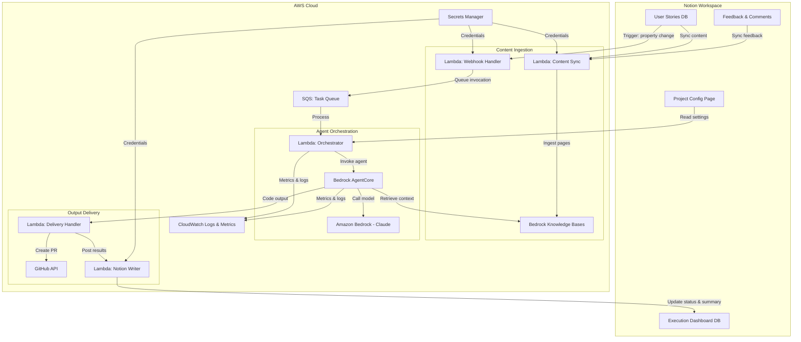

# Design Specification

**Project**: Notion-AWS Integration for AI-Driven Development Lifecycle (AI DLC)
**Version**: 0.1.0
**Last Updated**: 2026-02-03

## 1. Architecture Overview

### 1.1 High-Level Architecture



### 1.2 Technology Stack

| Layer | Technology | Purpose |
|-------|-----------|---------|
| Collaboration | Notion | User story management, team collaboration, trigger source |
| Webhook Processing | AWS Lambda | Receive and validate Notion triggers |
| Task Queue | Amazon SQS | Decouple trigger reception from agent execution |
| Context Storage | Amazon Bedrock Knowledge Bases | Store and retrieve Notion content for agents |
| Agent Runtime | Amazon Bedrock AgentCore | Serverless execution environment for AI agents |
| Foundation Model | Amazon Bedrock (Claude) | Code generation, spec generation, review |
| Code Delivery | GitHub API | Pull request creation and management |
| Secrets | AWS Secrets Manager | Notion tokens, GitHub tokens |
| Monitoring | Amazon CloudWatch | Logs, metrics, cost tracking |
| Infrastructure | AWS CDK | Infrastructure as Code |

### 1.3 Design Principles

1. **Event-Driven**: All workflows are triggered by events (Notion changes, SQS messages, agent completion), not polling
2. **Serverless-First**: No long-running servers; all compute is on-demand (Lambda, AgentCore)
3. **Decoupled Components**: SQS between webhook handler and orchestrator allows independent scaling and retry
4. **Idempotent Operations**: All handlers are idempotent; duplicate events produce the same result
5. **Observable**: Every component emits structured logs and metrics to CloudWatch

## 2. Data Models

### 2.1 Agent Invocation Record

Stored in a DynamoDB table for tracking; mirrored to Notion dashboard.

| Field | Type | Description |
|-------|------|-------------|
| invocation_id | string (ULID) | Unique identifier for this invocation |
| notion_page_id | string | Source Notion page that triggered this invocation |
| workspace_id | string | Notion workspace identifier |
| agent_type | enum | `spec`, `code`, `review` |
| status | enum | `queued`, `running`, `completed`, `failed`, `cancelled` |
| input_context | object | Serialized user story, acceptance criteria, related pages |
| output_summary | string | Human-readable summary of what the agent produced |
| output_artifacts | list | Links to PRs, generated files, etc. |
| parent_invocation_id | string (nullable) | For chained workflows, the previous step's ID |
| config | object | Project settings applied to this invocation |
| cost_usd | decimal | Estimated cost of this invocation |
| token_usage | object | `{input_tokens, output_tokens}` |
| started_at | datetime | When agent execution began |
| completed_at | datetime (nullable) | When agent execution finished |
| error_detail | string (nullable) | Error information if status is `failed` |
| created_at | datetime | Record creation timestamp |

### 2.2 Project Configuration

Stored in DynamoDB; editable via Notion configuration page.

| Field | Type | Description |
|-------|------|-------------|
| project_id | string | Unique project identifier |
| workspace_id | string | Notion workspace identifier |
| notion_database_id | string | Notion database containing user stories |
| github_repo | string | Target repository (owner/name) |
| github_branch_strategy | enum | `feature-branch`, `direct-to-main` |
| coding_standards | text | Free-text coding conventions for agents |
| framework_preferences | list | Preferred frameworks/libraries |
| agent_chain_template | enum | `story-to-code`, `story-to-spec-to-code`, `custom` |
| cost_limit_per_invocation | decimal | Max USD per single agent run |
| cost_limit_per_month | decimal | Max USD per month for this project |
| knowledge_base_id | string | Associated Bedrock Knowledge Base ID |
| created_at | datetime | Record creation timestamp |
| updated_at | datetime | Last update timestamp |

### 2.3 Notion Content Document (Knowledge Base)

Ingested into Bedrock Knowledge Bases as structured documents.

| Field | Type | Description |
|-------|------|-------------|
| page_id | string | Notion page identifier |
| parent_page_id | string (nullable) | Parent page for hierarchy |
| title | string | Page title |
| content_markdown | text | Page content converted to markdown |
| page_type | enum | `epic`, `user_story`, `task`, `design`, `general` |
| properties | object | Notion database properties (status, assignee, priority, etc.) |
| comments | list | Page comments and discussions |
| last_edited_at | datetime | Last edit time in Notion |
| ingested_at | datetime | When this version was ingested |

## 3. API Design

### 3.1 Webhook Endpoint (Notion → AWS)

| Method | Endpoint | Description |
|--------|----------|-------------|
| POST | /webhook/notion | Receives Notion webhook events for page updates |

**Request Body** (from Notion webhook):
```json
{
  "type": "page.updated",
  "page_id": "abc-123",
  "workspace_id": "ws-456",
  "properties_changed": ["Status"]
}
```

**Trigger Condition**: The handler checks if the `Status` property changed to a configured trigger value (e.g., "Generate Code").

### 3.2 Internal Orchestration API

| Method | Endpoint | Description |
|--------|----------|-------------|
| POST | /invoke | Queue a new agent invocation |
| GET | /invocation/{id} | Get invocation status and results |
| POST | /invocation/{id}/cancel | Cancel a running invocation |
| GET | /project/{id}/invocations | List invocations for a project |

### 3.3 Content Sync API

| Method | Endpoint | Description |
|--------|----------|-------------|
| POST | /sync/page | Trigger sync for a specific Notion page |
| POST | /sync/database | Trigger sync for an entire Notion database |
| GET | /sync/status/{job_id} | Check sync job status |

## 4. Component Design

### 4.1 Webhook Handler (Lambda)

**Purpose**: Receives Notion webhook events, validates them, and queues agent invocations.

**Inputs**: Notion webhook POST payload
**Outputs**: SQS message for orchestrator

**Key Logic**:
1. Validate webhook signature
2. Check if the event matches a trigger condition (e.g., status changed to "Generate Code")
3. Fetch the full page content from Notion API
4. Resolve project configuration from DynamoDB
5. Enqueue an invocation message to SQS

### 4.2 Content Sync (Lambda)

**Purpose**: Ingests Notion content into Bedrock Knowledge Bases.

**Inputs**: Notion page ID or database ID
**Outputs**: Updated Knowledge Base documents

**Key Logic**:
1. Fetch page content and sub-pages from Notion API (respecting rate limits)
2. Convert Notion blocks to markdown format
3. Extract and preserve properties, comments, and relationships
4. Upsert documents into Knowledge Base with metadata
5. Handle incremental updates (only changed pages)

### 4.3 Orchestrator (Lambda)

**Purpose**: Manages agent lifecycle — reads from SQS, invokes AgentCore, tracks status.

**Inputs**: SQS invocation message
**Outputs**: Agent invocation on AgentCore, status updates to DynamoDB and Notion

**Key Logic**:
1. Dequeue invocation request from SQS
2. Create invocation record in DynamoDB (status: `queued`)
3. Assemble agent prompt with user story context, project config, and Knowledge Base references
4. Invoke AgentCore with assembled prompt and tools
5. Monitor agent execution, updating status in DynamoDB
6. On completion, trigger delivery handler
7. For chained workflows, queue the next step

### 4.4 Agent Definitions (AgentCore)

Three agent types, each with a distinct system prompt and tool set:

**Spec Agent**:
- Input: User story + Knowledge Base context
- Tools: Knowledge Base retrieval
- Output: Requirements document, design notes, task breakdown
- System prompt focuses on translating user stories into technical specifications

**Code Agent**:
- Input: User story (or spec from Spec Agent) + Knowledge Base context + project config
- Tools: Knowledge Base retrieval, code execution sandbox
- Output: Implementation code, test files, PR description
- System prompt focuses on generating production-quality code following project conventions

**Review Agent**:
- Input: Generated code + acceptance criteria + Knowledge Base context
- Tools: Knowledge Base retrieval, code analysis
- Output: Review comments, pass/fail assessment, suggested improvements
- System prompt focuses on validating code against acceptance criteria

### 4.5 Delivery Handler (Lambda)

**Purpose**: Takes agent output and delivers it to GitHub and Notion.

**Inputs**: Agent execution results from AgentCore
**Outputs**: GitHub PR, Notion page updates

**Key Logic**:
1. Receive agent completion event
2. Create GitHub branch and commit generated code
3. Open pull request with description referencing Notion story
4. Generate human-readable summary of changes
5. Update Notion page with PR link, summary, and status
6. Update invocation record in DynamoDB with output artifacts

## 5. Security Architecture

- **Authentication**:
  - Notion: OAuth 2.0 integration token stored in Secrets Manager
  - GitHub: Personal access token or GitHub App credentials stored in Secrets Manager
  - AWS: IAM roles with least-privilege policies per Lambda function
- **Authorization**:
  - Webhook endpoint validates Notion webhook signatures
  - Each Lambda has a scoped IAM role (e.g., orchestrator can invoke AgentCore but cannot write to S3 directly)
  - AgentCore agent sessions are isolated per invocation
- **Data Encryption**:
  - In transit: TLS 1.2+ for all API calls (Notion, GitHub, internal)
  - At rest: AES-256 via AWS KMS for DynamoDB, Knowledge Bases, SQS
- **Secrets Management**:
  - All credentials in AWS Secrets Manager with automatic rotation where supported
  - No credentials in code, environment variables reference Secrets Manager ARNs

## 6. Error Handling

### Error Response Format

All internal APIs return errors in a consistent format:
```json
{
  "error": {
    "code": "AGENT_TIMEOUT",
    "message": "Agent execution exceeded the configured timeout of 300 seconds",
    "invocation_id": "01HQXYZ...",
    "remediation": "Try simplifying the user story or increasing the timeout in project settings"
  }
}
```

### Retry Strategies

| Component | Retry Policy | Max Retries | Backoff |
|-----------|-------------|-------------|---------|
| Notion API calls | On 429 (rate limit) and 5xx | 5 | Exponential with jitter, respect Retry-After header |
| SQS message processing | On Lambda failure | 3 | SQS visibility timeout (30s, 60s, 120s) |
| AgentCore invocation | On transient errors | 2 | 30s, 60s |
| GitHub API calls | On 5xx | 3 | Exponential (2s, 4s, 8s) |

### Dead Letter Queue

Failed SQS messages (after max retries) are sent to a DLQ. A CloudWatch alarm triggers on DLQ depth > 0, notifying the team.

### Logging

- Structured JSON logs to CloudWatch Logs
- Log levels: ERROR (failures), WARN (retries, rate limits), INFO (invocation lifecycle), DEBUG (detailed context)
- Correlation ID (invocation_id) propagated across all components for tracing

## 7. Deployment Architecture

### Infrastructure as Code

All resources defined in AWS CDK (TypeScript), organized by stack:

```
infra/
├── bin/
│   └── app.ts                    # CDK app entry point
├── lib/
│   ├── notion-webhook-stack.ts   # API Gateway + webhook Lambda
│   ├── content-sync-stack.ts     # Sync Lambda + Knowledge Base
│   ├── orchestration-stack.ts    # Orchestrator Lambda + SQS + DynamoDB
│   ├── delivery-stack.ts         # Delivery Lambda
│   └── monitoring-stack.ts       # CloudWatch dashboards & alarms
└── config/
    └── environments.ts           # Per-environment configuration
```

### Environments

| Environment | Purpose | Notion Workspace | AWS Account |
|-------------|---------|-----------------|-------------|
| dev | Development and testing | Dev workspace | Dev account |
| workshop | Pre-configured for workshop demos | Workshop workspace | Workshop account |
| prod | Production use by teams | Team workspaces | Prod account |

### CI/CD

- GitHub Actions for build, test, and deploy
- CDK diff on PR, CDK deploy on merge to main
- Separate deployment pipelines per environment
