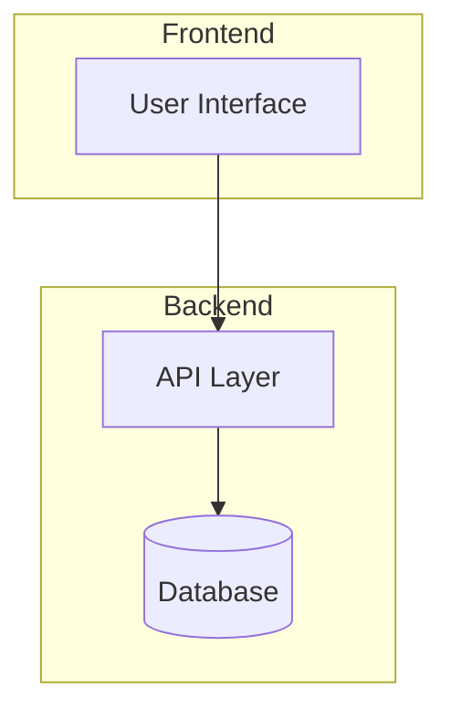

# Design Specification

**Project**: <!-- TODO: Your project name -->
**Version**: 0.1.0
**Last Updated**: YYYY-MM-DD

## 1. Architecture Overview

### 1.1 High-Level Architecture

<!-- TODO: Add architecture diagram using Mermaid or a description -->
<!--

-->

### 1.2 Technology Stack

| Layer | Technology | Purpose |
|-------|-----------|---------|
| Frontend | <!-- e.g., React, Vue --> | User interface |
| Backend | <!-- e.g., Node.js, Python --> | API and business logic |
| Database | <!-- e.g., PostgreSQL, DynamoDB --> | Data persistence |
| Infrastructure | <!-- e.g., AWS, GCP --> | Cloud hosting |

## 2. Data Models

### 2.1 [Entity Name]

<!-- TODO: Define your data models -->

| Field | Type | Description |
|-------|------|-------------|
| id | string | Unique identifier |
| created_at | datetime | Creation timestamp |

## 3. API Design

### 3.1 [API Group]

<!-- TODO: Define your API contracts -->

| Method | Endpoint | Description |
|--------|----------|-------------|
| GET | /api/resource | List resources |
| POST | /api/resource | Create resource |

## 4. Component Design

### 4.1 [Component Name]

**Purpose**: <!-- What this component does -->
**Inputs**: <!-- What it receives -->
**Outputs**: <!-- What it produces -->

## 5. Security Architecture

- Authentication: <!-- Method -->
- Authorization: <!-- Method -->
- Data encryption: <!-- At rest and in transit -->

## 6. Error Handling

- Error response format
- Retry strategies
- Logging approach

## 7. Deployment Architecture

<!-- TODO: Describe how the application is deployed -->
